# Boss of the SOC v1 — Website Defacement Investigation

A Splunk-based investigation of a simulated website defacement attack against `imreallynotbatman[.]com`, using the [BOTS v1](https://github.com/splunk/botsv1) dataset. This walkthrough traces the attack from initial reconnaissance through exploitation, defacement, and credential brute forcing.

> **Note:** All URLs and IPs in this writeup are defanged as best practice, so nothing here is accidentally clickable. Answers submitted per question are left undefanged — treat those with caution.

A polished version of this writeup is also published on [Medium](https://medium.com/@skizzydera/boss-of-the-soc-v1-botsv1-b852ffcfb16c).

---

## Scenario

On Alice's first day at the Wayne Enterprises Security Operations Center, Lucius Fox assigns her an initial case: a memo from the Gotham City Police Department (GCPD) citing evidence, posted to Pastebin (`hxxp://pastebin[.]com/Gw6dWjS9`), that `www[.]imreallynotbatman[.]com`, hosted on Wayne Enterprises' IP address space, may have been defaced. The site is the personal blog of Wayne Corporation's CEO. Defacement is a known signature tactic of the threat group referenced in the memo. Alice's objective is to confirm, using available log sources, whether the compromise actually occurred.

**Objective:** Identify which indexes and sourcetypes are available for this investigation before running any searches.

**Method:** The challenge specifies `index=botsv1`. A review of available sourcetypes shows the following: Windows Event Logs (`WinEventLog:Application/Security/System`, `WinRegistry`) for host-level Windows activity; Sysmon (`XmlWinEventLog:Microsoft-Windows-Sysmon/Operational`) for deep process and network telemetry; Fortigate firewall logs (`fgt*`) for perimeter traffic; IIS logs for web server request records; Nessus scan data for known vulnerabilities; Stream logs (`stream:*`) for raw packet capture; Suricata for IDS/IPS alerts.

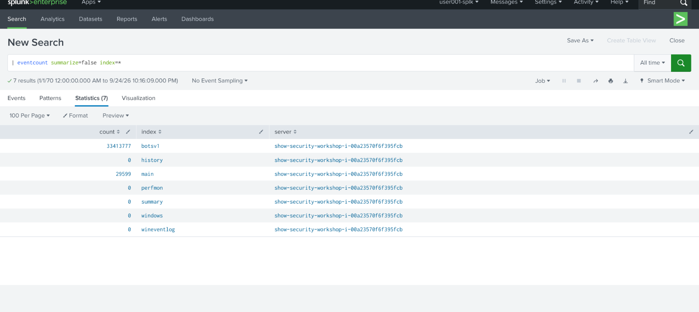
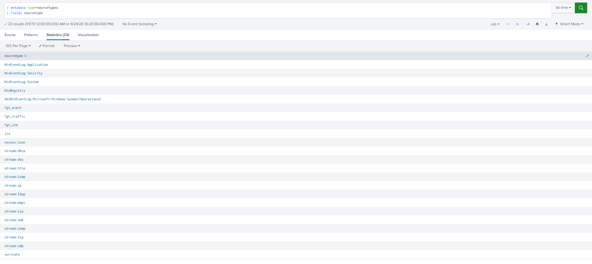

**Finding:** This gives a layered view of the environment: network perimeter (firewall, Suricata, Stream), web server (IIS), and host (Sysmon, WinEventLog). Each question can be answered from the most appropriate data source rather than guessing.

---

## Question 1 — Likely IPv4 address of the Po1s0n1vy scanner

```spl
index=botsv1 sourcetype=fgt* "imreallynotbatman[.]com"
| timechart count by srcip
```

**Method:** Firewall logs capture every source IP interacting with the web server. Scoping the search to the attack date and the target domain isolates relevant traffic. `timechart count by srcip` visualizes request volume per source over time, making abnormal spikes — a hallmark of automated scanning — visible at a glance.

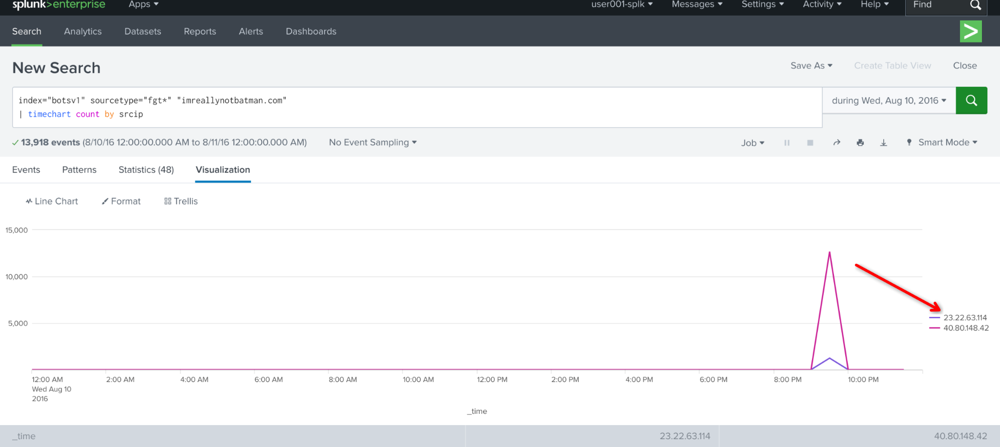

**Finding:** One source IP, `40[.]80[.]148[.]42`, shows a sharp, sustained spike in request volume relative to all other sources during the attack period, consistent with automated vulnerability scanning rather than normal user traffic.

**Answer:** `40.80.148.42`

---

## Question 2 — Vendor of the scanner used

**Objective:** Identify the vendor of the vulnerability scanner used by Po1s0n1vy.

```spl
index=botsv1 sourcetype=fgt* "imreallynotbatman[.]com"
```

**Method:** Firewall logs classify traffic by attack signature. Filtering to the compromised host's traffic and reviewing the top attack signatures surfaces the tool fingerprint directly.

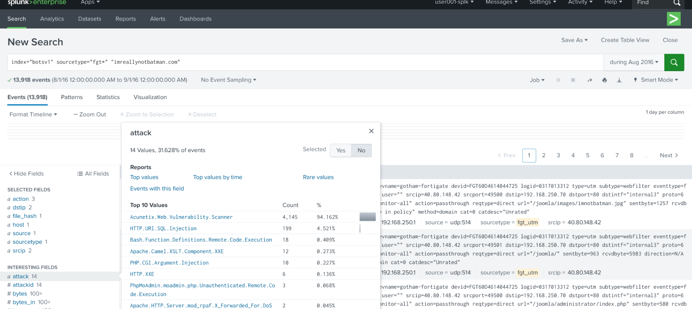

**Finding:** The dominant attack signature logged against `imreallynotbatman[.]com` is `Acunetix.Web.Vulnerability.Scanner`, indicating the scans were performed using Acunetix.

**Answer:** `Acunetix`

---

## Question 3 — CMS used by imreallynotbatman[.]com

**Objective:** Determine the content management system running on `imreallynotbatman[.]com`.

```spl
index=botsv1 sourcetype=fgt* "imreallynotbatman[.]com"
| table _time, dest, vendor_url
| dedup vendor_url
```

**Method:** Firewall logs tag matched signatures with a `vendor_url` field identifying the software component the signature is written for. Deduplicating this field against traffic to `imreallynotbatman[.]com` isolates the distinct platforms referenced in Acunetix's scan results.

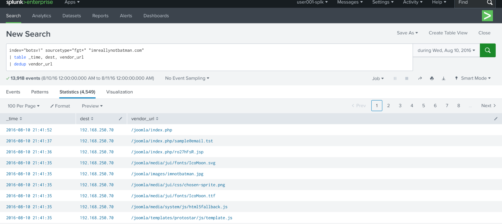

**Finding:** The `vendor_url` field returns Joomla as the platform referenced in the scan traffic against `imreallynotbatman[.]com`.

**Answer:** `Joomla`

---

## Question 4 — Name of the file that defaced the site

**Objective:** Identify the specific file used to deface `imreallynotbatman[.]com`.

```spl
index=botsv1 sourcetype=stream:http c_ip=192[.]168[.]250[.]70
| table _time, c_ip, dest_ip, uri, url
| dedup url
```

**Method:** `stream:http` captures HTTP traffic over the network, so any file transfer between hosts shows up here. Filtering by the web server's own IP as the client (`c_ip=192[.]168[.]250[.]70`) catches the server itself reaching out to fetch a file — how the defacement was actually delivered. Deduplicating on `url` narrows the results down to distinct destinations, making it easy to spot anything unusual.

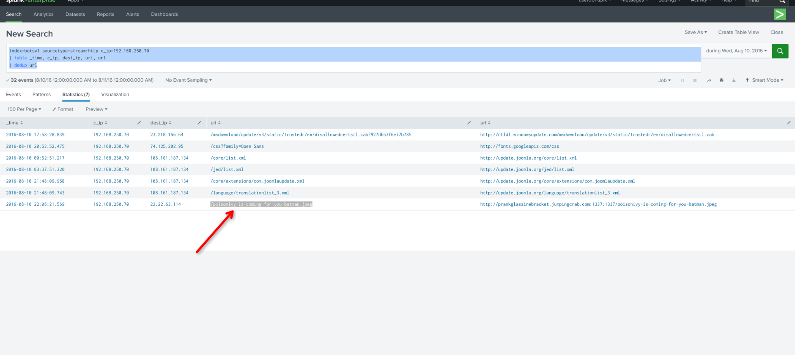

**Finding:** Among the URLs returned, one stands out as clearly malicious: `/poisonivy-is-coming-for-you-batman.jpeg`. The filename directly references Po1s0n1vy, the group named in the GCPD memo, confirming this as the defacement file.

**Answer:** `poisonivy-is-coming-for-you-batman.jpeg`

---

## Question 5 — FQDN associated with the attack (dynamic DNS)

**Objective:** Identify the fully qualified domain name resolving to the malicious IP used to stage the defacement file.

**Query:** Reuses the result set from Question 4, no new search required.

**Method:** The `url` field captured in the previous query includes the full destination address the web server reached out to, not just the file path. That field shows the domain the defacement file was actually hosted on, before it resolved to an IP.

**Finding:** The `url` field from Question 4's results shows the file was retrieved from `prankglassinebracket[.]jumpingcrab[.]com`, a dynamic DNS domain (`jumpingcrab[.]com` is a known DDNS provider), consistent with attackers using dynamic DNS to mask the true hosting IP and rotate infrastructure.

**Answer:** `prankglassinebracket.jumpingcrab.com`

---

## Question 6 — IPv4 address tied to Po1s0n1vy's pre-staged domains

**Query:** Reuses the result set from Question 4.

**Method:** The same table includes `dest_ip`, the actual IP the web server connected to when retrieving the file from `prankglassinebracket[.]jumpingcrab[.]com`.

**Finding:** `dest_ip` shows `23[.]22[.]63[.]114`, tying the dynamic DNS domain to Po1s0n1vy's staging infrastructure.

**Answer:** `23.22.63.114`

---

## Question 7 — IPv4 address attempting a brute force attack

```spl
index=botsv1 sourcetype=stream:http "imreallynotbatman" "23[.]22[.]63[.]114" form_data="*"
| table _time, src_ip, form_data
| dedup src_ip
```

**Method:** Pivoting off the IP tied to the defacement upload, this filters HTTP traffic to `imreallynotbatman[.]com` that includes form submissions — how a login brute force would show up in the logs — and isolates it to source IP addresses making those submissions.

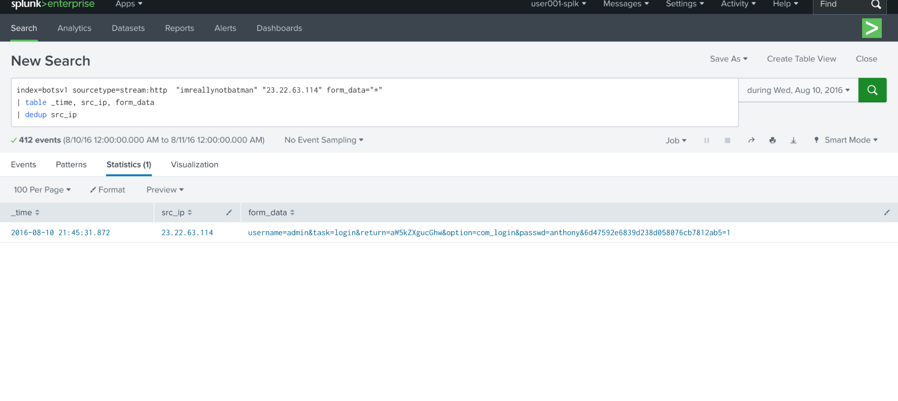

**Finding:** 412 events show repeated POST attempts carrying a `username` and `passwd` field, consistent with automated credential guessing rather than a single legitimate login. All 412 attempts originate from a single source IP, `23[.]22[.]63[.]114`, the same address tied to the defacement staging infrastructure identified in Question 6.

**Answer:** `23.22.63.114`

---

## Question 8 — Name of the executable uploaded by Po1s0n1vy

*Answer guidance: include file extension (e.g. "notepad.exe" or "favicon.ico").*

```spl
index=botsv1 sourcetype=fgt* "imreallynotbatman" "*.exe"
```

**Method:** Firewall logs flag files matched against threat signatures and behaviors, including any known malicious executables passing through. Filtering to traffic against `imreallynotbatman[.]com` and searching for `.exe` file references surfaces any executable the firewall caught over the network.

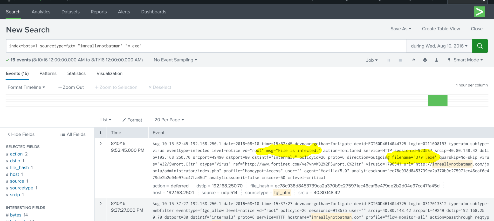

**Finding:** The search returns a single match, `3791.exe`, logged with a "File is infected" alert, confirming it as a known malicious file caught by the firewall's detection engine, and matching the executable Po1s0n1vy uploaded to the compromised server.

**Answer:** `3791.exe`

---

## Question 9 — MD5 hash of the uploaded executable

**Method:** The firewall log from Question 8 returns a SHA256 hash, not MD5. Taking that SHA256 hash and searching it on VirusTotal pulls up the file's full profile, including all associated hash values.

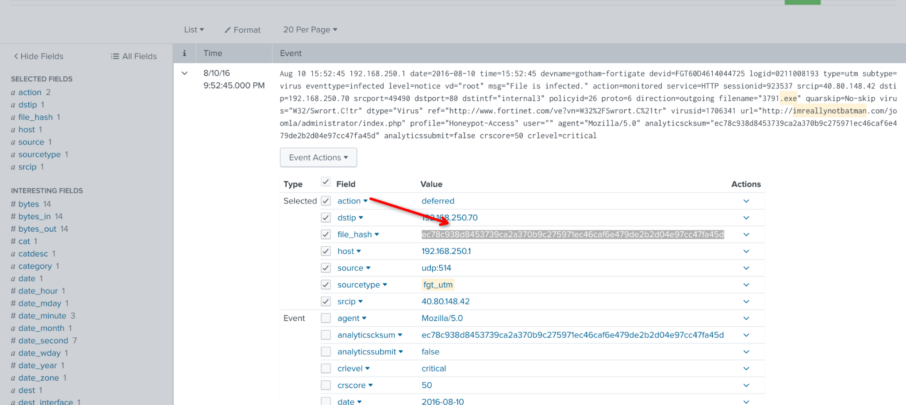
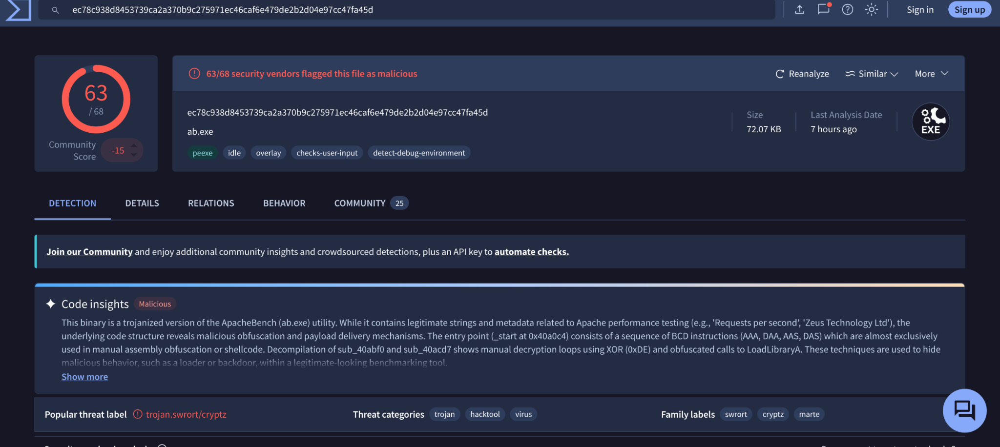

**Finding:** VirusTotal identifies the file's original name as `ab.exe`, renamed to `3791.exe` by the attackers before upload. The corresponding MD5 hash listed for the file is `aae3f5a29935e6abcc2c2754d12a9af0`.

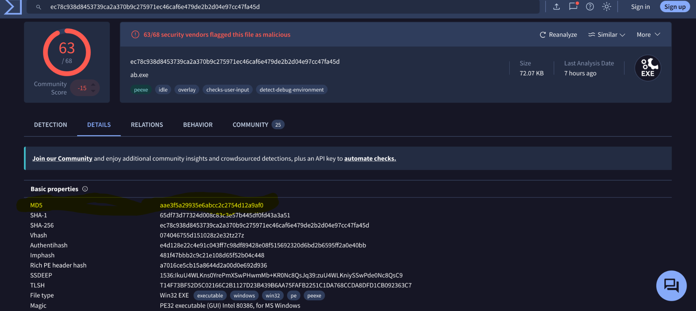

**Answer:** `aae3f5a29935e6abcc2c2754d12a9af0`

---

## Question 10 — SHA256 hash of the spear phishing malware

*GCPD reported that a common Po1s0n1vy TTP, when initial compromise fails, is to send a spear phishing email with custom malware tied to their existing infrastructure.*

**Objective:** Find the SHA256 hash of that phishing malware.

**Method:** Using the IP identified in Question 6 (`23[.]22[.]63[.]114`) as a pivot point, searching that IP on VirusTotal surfaces files and campaigns associated with it, including any phishing payloads sharing the same infrastructure.

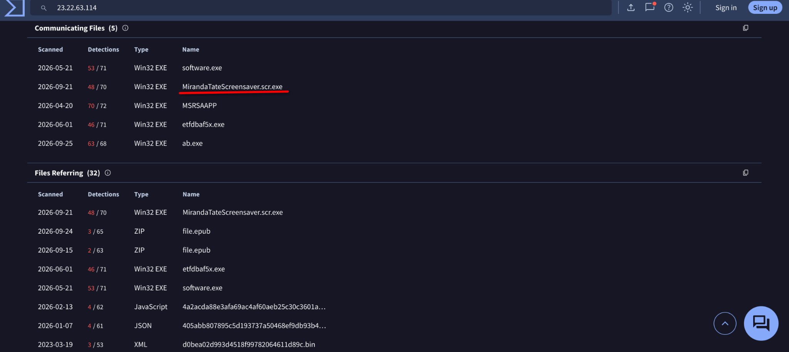

**Finding:** VirusTotal's results for that IP include a file named `MirandaTateScreensaver.scr.exe` — a name and double extension consistent with a phishing lure (disguising an executable as a screensaver). Its SHA256 hash matches the malware tied to Po1s0n1vy's infrastructure.

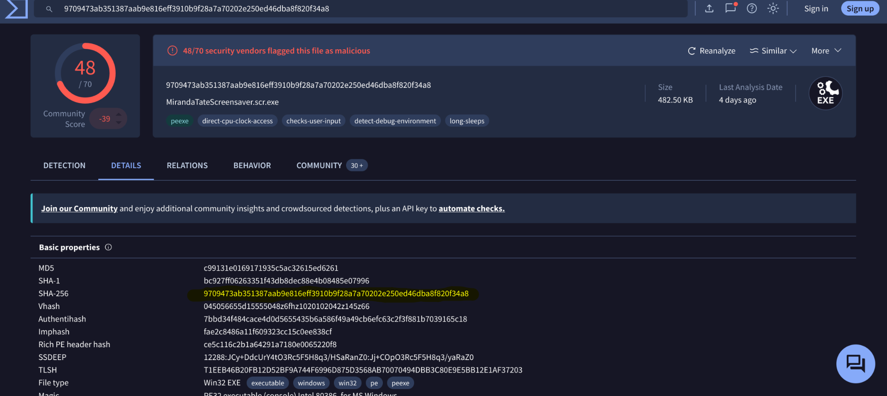

**Answer:** `9709473ab351387aab9e816eff3910b9f28a7a70202e250ed46dba8f820f34a8`

---

## Question 11 — Special hex code associated with the malware

**Method:** Checked VirusTotal's community comments for this sample. Analysts sometimes leave notes there beyond the automated scan results, and this one had a hex-encoded string tucked in the comments.

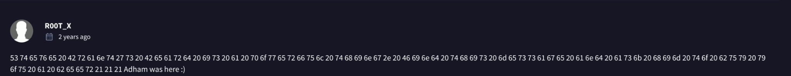

**Finding:** Decoded, it's not malware functionality at all — just a message left by whoever submitted or analyzed the sample.

**Answer:** `53 74 65 76 65 20 42 72 61 6e 74 27 73 20 42 65 61 72 64 20 69 73 20 61 20 70 6f 77 65 72 66 75 6c 20 74 68 69 6e 67 2e 20 46 69 6e 64 20 74 68 69 73 20 6d 65 73 73 61 67 65 20 61 6e 64 20 61 73 6b 20 68 69 6d 20 74 6f 20 62 75 79 20 79 6f 75 20 61 20 62 65 65 72 21 21 21`

---

## Question 12 — First brute force password used

```spl
index=botsv1 sourcetype=stream:http "23[.]22[.]63[.]114" form_data="*"
| rex field=form_data "passwd=(?<password>[^&]+)"
| rex field=form_data "username=(?<user_name>[^&]+)"
| table _time, password, user_name
```

**Method:** Pulled the login attempts from the same brute force IP identified earlier, then used `rex` to extract the username and password fields out of the raw form data. Sorted by `_time` to see the order the passwords were actually tried in.

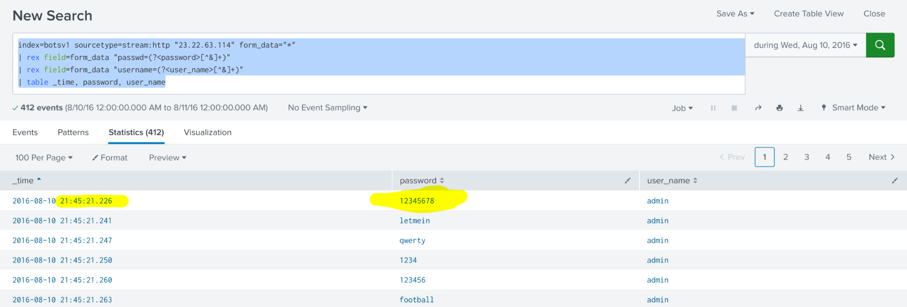

**Finding:** The earliest timestamp in the results shows `12345678` as the first password attempted.

**Answer:** `12345678`

---

## Question 13 — James Brodsky's favorite Coldplay song (6-character password)

```spl
index=botsv1 sourcetype=stream:http "23[.]22[.]63[.]114" form_data="*"
| rex field=form_data "passwd=(?<password>[^&]+)"
| rex field=form_data "username=(?<user_name>[^&]+)"
| eval length = len(password)
| table _time, password, user_name, length
| search length=6
```

**Method:** Filtered the brute force attempts down to six-character passwords, per the question's hint. From there it's less Splunk and more OSINT — had to actually look up James Brodsky's favorite Coldplay song since the log data alone won't tell you that.

**Answer:** `yellow`

---

## Question 14 — Correct admin password for the CMS

```spl
index=botsv1 sourcetype=* imreallynotbatman form_data="*&passwd*"
| rex field=form_data "passwd=(?<password>[^&]+)"
| rex field=form_data "username=(?<user_name>[^&]+)"
| eval length = len(password)
| table _time, password, user_name, length
```

**Method:** Pulled every login attempt and sorted by time. Simple logic here — a brute force doesn't keep going once it works, so whatever password shows up last in the sequence is the one that probably got them in.

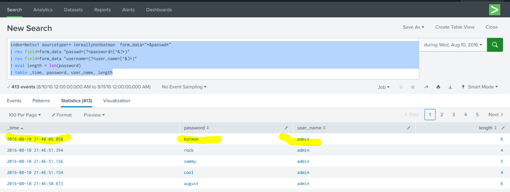

**Finding:** The last attempt in the timeline is `batman`, right after that the attempts just stop. Fitting, honestly, given the site's name.

**Answer:** `batman`

---

## Question 15 — Average password length in the brute force attempt

*Answer guidance: round to nearest whole integer.*

**Objective:** Calculate the average length across all passwords submitted in the brute force attempt.

```spl
index=botsv1 sourcetype=* imreallynotbatman form_data="*&passwd*"
| rex field=form_data "passwd=(?<password>[^&]+)"
| rex field=form_data "username=(?<user_name>[^&]+)"
| eval length = len(password)
| stats avg(length)
```

**Method:** Extracted the password from each login attempt, calculated its character length, then took the average across the full set of attempts.

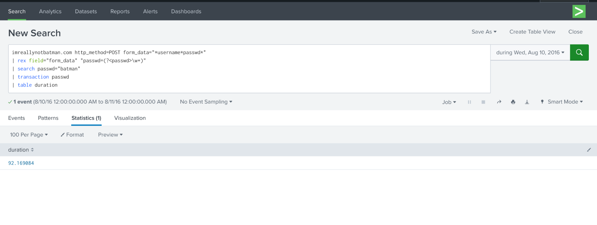

**Finding:** `stats avg(length)` returns `6.174334140435835`, rounded to the nearest whole number as instructed.

**Answer:** `6`

---

## Question 16 — Time between correct password identification and compromised login

*Answer guidance: round to 2 decimal places.*

```spl
index=botsv1 sourcetype=stream:http imreallynotbatman[.]com http_method=POST form_data="*username*passwd*"
| rex field="form_data" "passwd=(?<passwd>\w+)"
| search passwd="batman"
| transaction passwd
| table duration
```

**Method:** `transaction` groups all events tied to the password `batman` and calculates the time span between them, giving the gap between when it first showed up and when it succeeded.

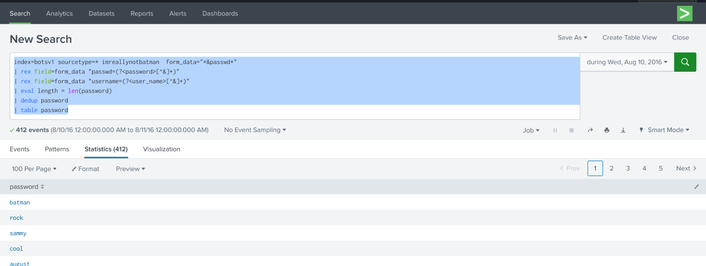

**Finding:** Couldn't work this one out independently — looked up the approach and confirmed it with the query above.

**Answer:** `92.17`

---

## Question 17 — Number of unique passwords attempted

```spl
index=botsv1 sourcetype=* imreallynotbatman form_data="*&passwd*"
| rex field=form_data "passwd=(?<password>[^&]+)"
| rex field=form_data "username=(?<user_name>[^&]+)"
| eval length = len(password)
| dedup password
| table password
```

**Method:** Deduplicating on `password` strips out repeats, leaving only distinct values — a straightforward way to count how many unique passwords the attacker actually tried across the whole brute force run.

**Finding:** The deduplicated count comes out to 412.

**Answer:** `412`

---

## Tools & Data

- **Platform:** Splunk (SPL)
- **Dataset:** [BOTS v1](https://github.com/splunk/botsv1) (`index=botsv1`)
- **Sourcetypes used:** `fgt*` (Fortigate firewall), `stream:http`, IIS
- **Supplementary research:** VirusTotal (hash lookups, community comments), OSINT

## Repo Contents

```
.
├── README.md
└── screenshots/
    ├── screenshot_01.png
    ├── screenshot_02.png
    └── ...
```
